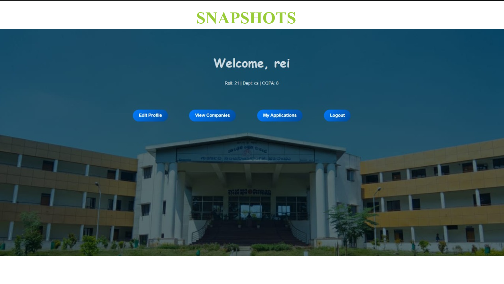
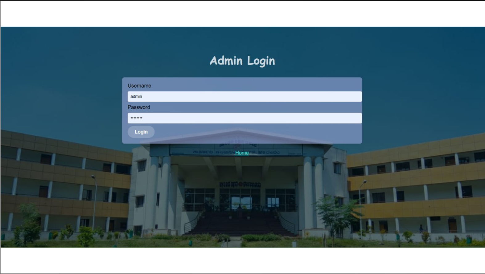
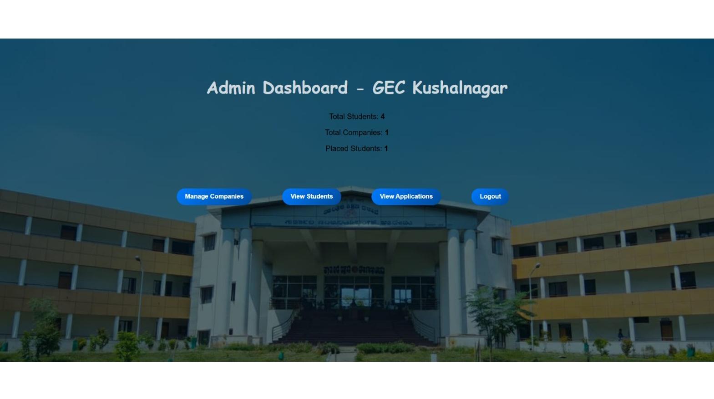
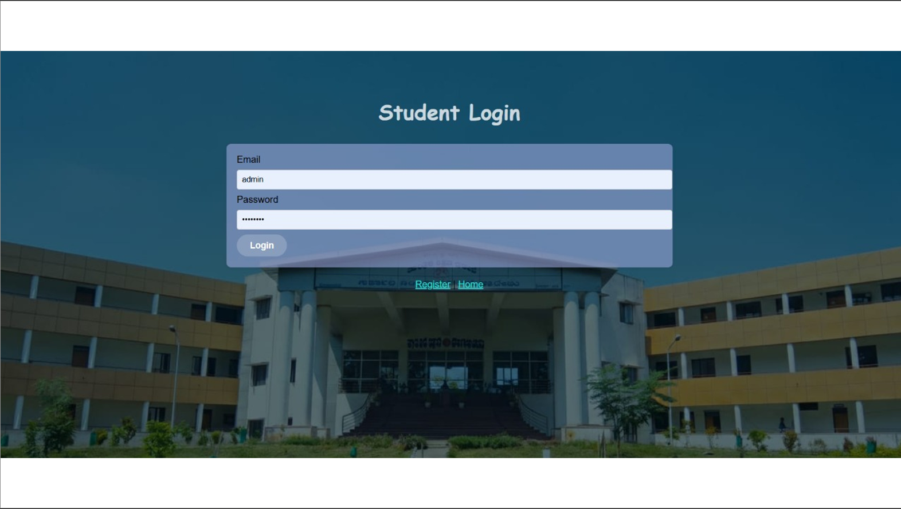
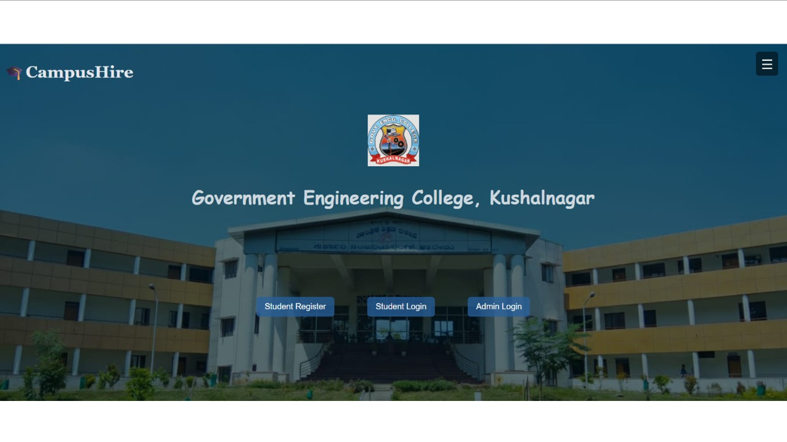

# 🎓 Placement Management System

## 📖 Overview

The Placement Management System is a web-based application developed using **PHP** and **MySQL** to simplify and automate the campus recruitment process. It provides a centralized platform for students, placement officers, and administrators to manage placement activities efficiently.

---

## ✨ Features

- 👨‍🎓 Student Registration & Login
- 👨‍💼 Admin Login
- 🏢 Company Management
- 📋 Student Dashboard
- 📢 Placement Notifications
- 📁 Resume/File Upload
- 🔒 Secure Authentication
- 💾 Database Management

---

## 🛠 Technologies Used

- HTML5
- CSS3
- JavaScript
- PHP
- MySQL
- XAMPP

---

## 📂 Project Structure

```
Placement-Management-System/
│
├── admin/
├── assets/
├── database/
├── student/
├── uploads/
├── config.php
├── index.php
├── login.php
└── register.php
```

---

## 🚀 Installation & Setup

1. Install **XAMPP**.
2. Copy the project folder into the **htdocs** directory.
3. Start **Apache** and **MySQL** using the XAMPP Control Panel.
4. Open **phpMyAdmin** and import the SQL database from the **database** folder.
5. Open your browser and visit:

```
http://localhost/placement_system
```

---

## 📸 Screenshots

### 🏠 Home Page


### 👨‍💼 Admin Login


### 📊 Admin Dashboard


### 👨‍🎓 Student Login


### 👨‍🎓 Student Dashboard


## 📌 Future Enhancements

- AI-based Resume Screening
- Smart Job Recommendation System
- Automated Interview Scheduling
- Email & SMS Notifications
- Mobile Application
- Analytics Dashboard

---

## 👩‍💻 Developed By

**Taniya M**

Bachelor of Engineering (Computer Science & Engineering)

Government Engineering College, Kushalnagar

---

## 📄 License

This project is intended for educational and academic purposes only.
